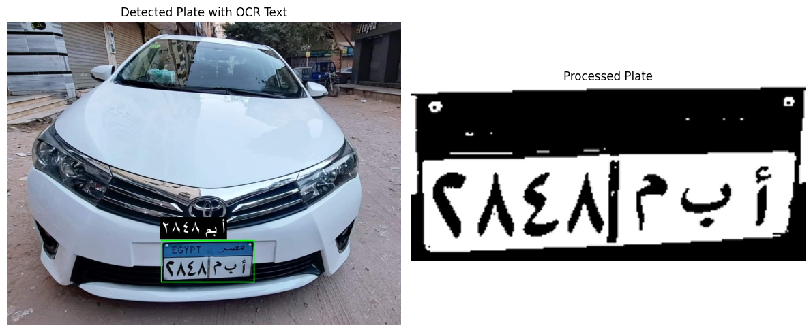

# 🚗 Egyptian Car Plate Detection & Recognition

A lightweight deep learning system for detecting and recognizing **Egyptian license plates** using a custom-trained **YOLOv8n** model and **EasyOCR (Arabic)**.  
Designed for fast inference, clean preprocessing, and simple usage.

---

## 📸 Example Output



---

## ✨ Features
- Custom-trained YOLOv8 model for Egyptian plates  
- Arabic OCR using EasyOCR  
- Preprocessing pipeline (grayscale → threshold → upscale)  
- Annotated output with bounding boxes & recognized text  
- Easy to configure and extend  

---

## 📁 Project Structure
```
Car-Plate-Detection/
├── main.py
├── utils.py
├── best.pt
├── requirements.txt
├── output.png
├── test.jpg
└── README.md
```

---

## 🔧 Installation
```bash
pip install -r requirements.txt
```

Libraries include:
- ultralytics  
- easyocr  
- opencv-python  
- numpy  
- pillow  
- torch  

---

## ▶️ Usage
Basic run:
```bash
python main.py
```

Optional:
```bash
python main.py --image test.jpg
python main.py --upscale 2.0
python main.py --save-plates
```

---

## 🧠 Pipeline Overview
1. YOLO detects the plate  
2. Cropping of the detected region  
3. Preprocessing (grayscale → thresholding → upscaling)  
4. OCR using EasyOCR (Arabic)  
5. Annotated visualization  

---

## 📈 Model Performance
- **Model**: YOLOv8n (custom trained)  
- **Training**: Google Colab GPU  
- **Dataset**: Egyptian Cars Plates (Kaggle)  
- **Input size**: 640  
- **CPU inference**: ~40–60ms/image  
- **Performance depends heavily on image clarity**  

---

## 🔤 OCR Accuracy & Limitations
OCR accuracy varies depending on:
- Lighting  
- Angle  
- Plate sharpness  
- Font variation  

EasyOCR limitations:
- Some Arabic characters may be misread  
- OCR on very small plates requires higher upscale (2.0–2.5)

Custom OCR training wasn’t implemented due to dataset size requirements.

---

## ⚠️ Common Issues (Short Version)

### 1) *No plate detected*  
- Reduce YOLO confidence  
```python
results = model.predict(image_path, conf=0.3)
```

### 2) *OCR output is wrong*  
- Increase upscale factor  
```python
--upscale 2.5
```

### 3) *Slow processing*  
- Reduce image resolution  
- Lower upscale value  

### 4) *CUDA not available*  
The system automatically falls back to CPU.

---

## 📂 Dataset
Dataset used for training:  
https://www.kaggle.com/datasets/mahmoudeldebase/egyptian-cars-plates

---

## 🚀 Future Improvements
- Real-time video support  
- Multi-plate detection per image  
- OCR post-correction  
- REST API endpoint  
- Plate tracking and logging  

---

## ✔️ Status
Active • Clean • Ready for use

